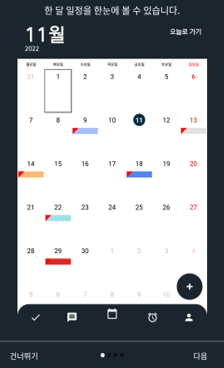
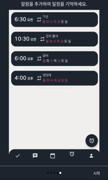
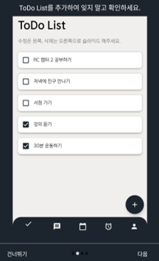
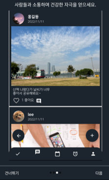

# 📌 Graduation Project: Task Manager (2022)

> 일정을 관리하고, 할 일을 체크하며, 알람과 소셜 기능까지 제공하는 통합형 Task 관리 시스템입니다.

---

## 🧩 프로젝트 소개

**Task Manager**는 사용자들이 일정을 효율적으로 관리하고, 할 일(To-do)을 정리하며, 알람 설정 및 소셜 커뮤니티를 통해 상호 소통할 수 있도록 설계된 통합형 일정 관리 애플리케이션입니다.

> "단순한 캘린더 앱을 넘어, 일상과 작업 관리를 통합할 수 있는 개인 맞춤형 플랫폼을 만드는 것을 목표로 했습니다."

---

## 🛠 사용 기술

| 분야 | 기술 스택 |
|------|-----------|
| Language | Java, JavaScript |
| Framework | Spring MVC |
| Front-End | JSP, HTML5, CSS3, Bootstrap, jQuery |
| Back-End | Java (Spring), Servlet, JSP |
| DB | MySQL |
| Build/Deploy | Apache Tomcat, Maven |
| 기타 | GitHub, Eclipse, VS Code |

---

## 💡 주요 구현 기능

### 1. 📅 **캘린더 기반 일정 관리**
- 월 단위 일정 확인 가능
- 날짜별 일정 시각화 (색상 표시)
- 일정 등록, 수정, 삭제 기능

---

### 2. ⏰ **알람 설정 및 반복 관리**
- 알람 시간 및 요일 설정
- 다중 알람 저장 및 알림 기능
- 직관적인 리스트 UI 구성

---

### 3. ✅ **To-Do List 기능**
- 할 일 등록, 완료 체크
- 슬라이드 제스처로 수정/삭제
- 완료/미완료 상태 시각적 구분

---

### 4. 💬 **커뮤니티 피드**
- 이미지 및 게시글 업로드
- 좋아요 및 댓글 기능 포함
- 사용자 간 소통 기능 제공

---

## 🚀 느낀 점 및 기술 성장

이 프로젝트를 통해 단순히 기능을 구현하는 수준을 넘어,  
전체적인 아키텍처 흐름을 설계하고 실제로 구현하며 실무 감각을 익힐 수 있었습니다.

---

## 📌 기타

- 해당 프로젝트는 졸업 후 일정 기간이 지나 현재는 실행 환경이 맞지 않아 구동이 어려울 수 있습니다.  
- 하지만 전체 구조와 기능 흐름은 위 이미지와 설명을 통해 확인하실 수 있습니다.

